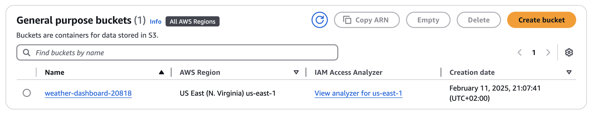
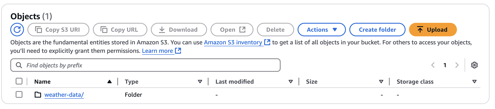
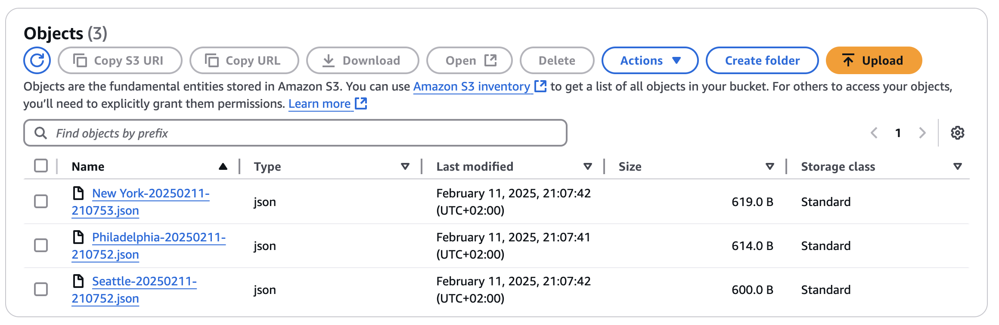

# Detailed Documentation for Weather Dashboard Demo

## Project Setup

### Directory Structure Initialization
1. **Create Project Directory**:
   - Command: `mkdir weather-dashboard-demo`
   - This creates a new directory for the project.

2. **Navigate into the Project Directory**:
   - Command: `cd weather-dashboard-demo`
   - Changes the current working directory to the newly created project directory.

3. **Create Subdirectories**:
   - Command: `mkdir src tests data`
   - Creates three directories:
     - `src`: To store all source files.
     - `tests`: Reserved for future test scripts.
     - `data`: To store any necessary data files.

4. **Create Project Files**:
   - Commands:
     - `touch src/__init__.py src/weather_dashboard.py`: Creates the Python package and the main script.
     - `touch requirements.txt README.md .env`: Creates files for dependencies, project description, and environment variables.

### Version Control Initialization
1. **Initialize Git**:
   - Command: `git init`
   - Initializes a new Git repository in the current directory.

2. **Set Main Branch**:
   - Command: `git branch -M main`
   - Renames the default branch to 'main'.

3. **Setup .gitignore**:
   - Commands:
     - `echo ".env" >> .gitignore`: Excludes the environment variables file from Git tracking.
     - `echo "__pycache__/" >> .gitignore`: Excludes Python cache files.
     - `echo "*.zip" >> .gitignore`: Excludes zip files to keep the repository clean.

### Dependency Management
1. **Populate requirements.txt**:
   - Commands:
     - `echo "boto3==1.26.137" >> requirements.txt`: Adds boto3 to the list of requirements.
     - `echo "python-dotenv==1.0.0" >> requirements.txt`: Adds python-dotenv for environment variable management.
     - `echo "requests==2.28.2" >> requirements.txt`: Adds requests for HTTP requests to external services.

2. **Install Dependencies**:
   - Command: `pip install -r requirements.txt`
   - Installs the Python packages necessary for the project as specified in `requirements.txt`.

### AWS Configuration and Environment Setup
1. **Configure AWS CLI**:
   - Command: `aws configure`
   - Sets up AWS credentials and default region, necessary for interacting with AWS services like S3.

2. **Set Environment Variables**:
   - Commands:
     - `echo "OPENWEATHER_API_KEY=your_api_key_here" >> .env`: Adds your OpenWeather API key to the environment file.
     - `echo "AWS_BUCKET_NAME=weather-dashboard-${RANDOM}" >> .env`: Generates a unique bucket name and stores it in the environment file.

### Python Script Explanation
- **`weather_dashboard.py`**:
  - This script includes all functionalities such as initializing the WeatherDashboard class, fetching weather data using the OpenWeather API, and saving this data to AWS S3. Detailed explanations of each class method and its functionality are provided inline in the code comments.
```py
import os
import json
import boto3
import requests
from datetime import datetime
from dotenv import load_dotenv

# Load environment variables
load_dotenv()

class WeatherDashboard:
    def __init__(self):
        self.api_key = os.getenv('OPENWEATHER_API_KEY')
        self.bucket_name = os.getenv('AWS_BUCKET_NAME')
        self.s3_client = boto3.client('s3')

    def create_bucket_if_not_exists(self):
        """Create S3 bucket if it doesn't exist"""
        try:
            self.s3_client.head_bucket(Bucket=self.bucket_name)
            print(f"Bucket {self.bucket_name} exists")
        except:
            print(f"Creating bucket {self.bucket_name}")
        try:
            # Simpler creation for us-east-1
            self.s3_client.create_bucket(Bucket=self.bucket_name)
            print(f"Successfully created bucket {self.bucket_name}")
        except Exception as e:
            print(f"Error creating bucket: {e}")

    def fetch_weather(self, city):
        """Fetch weather data from OpenWeather API"""
        base_url = "http://api.openweathermap.org/data/2.5/weather"
        params = {
            "q": city,
            "appid": self.api_key,
            "units": "imperial"
        }
        
        try:
            response = requests.get(base_url, params=params)
            response.raise_for_status()
            return response.json()
        except requests.exceptions.RequestException as e:
            print(f"Error fetching weather data: {e}")
            return None

    def save_to_s3(self, weather_data, city):
        """Save weather data to S3 bucket"""
        if not weather_data:
            return False
            
        timestamp = datetime.now().strftime('%Y%m%d-%H%M%S')
        file_name = f"weather-data/{city}-{timestamp}.json"
        
        try:
            weather_data['timestamp'] = timestamp
            self.s3_client.put_object(
                Bucket=self.bucket_name,
                Key=file_name,
                Body=json.dumps(weather_data),
                ContentType='application/json'
            )
            print(f"Successfully saved data for {city} to S3")
            return True
        except Exception as e:
            print(f"Error saving to S3: {e}")
            return False

def main():
    dashboard = WeatherDashboard()
    
    # Create bucket if needed
    dashboard.create_bucket_if_not_exists()
    
    cities = ["Philadelphia", "Seattle", "New York"]
    
    for city in cities:
        print(f"\nFetching weather for {city}...")
        weather_data = dashboard.fetch_weather(city)
        if weather_data:
            temp = weather_data['main']['temp']
            feels_like = weather_data['main']['feels_like']
            humidity = weather_data['main']['humidity']
            description = weather_data['weather'][0]['description']
            
            print(f"Temperature: {temp}°F")
            print(f"Feels like: {feels_like}°F")
            print(f"Humidity: {humidity}%")
            print(f"Conditions: {description}")
            
            # Save to S3
            success = dashboard.save_to_s3(weather_data, city)
            if success:
                print(f"Weather data for {city} saved to S3!")
        else:
            print(f"Failed to fetch weather data for {city}")

if __name__ == "__main__":
    main()
```
### Running the Application
- Command: `python src/weather_dashboard.py`
- Executes the script to fetch weather data for predefined cities, print the weather details, and save these details to the specified S3 bucket.

### Expected Output
- The console output should reflect the creation of an S3 bucket, fetching of weather data, and confirmation of data being saved in S3, with detailed temperature, feels-like temperature, humidity, and weather conditions for each city.

### AWS S3 Bucket Interaction
- **Viewing the S3 Bucket**:
  - After running the application, you should visit the AWS S3 console to see the newly created bucket and navigate to the `weather-data` folder to view the saved JSON files containing the weather data for each city.





## Appendix
- Additional configuration details, troubleshooting advice, and customization options.
